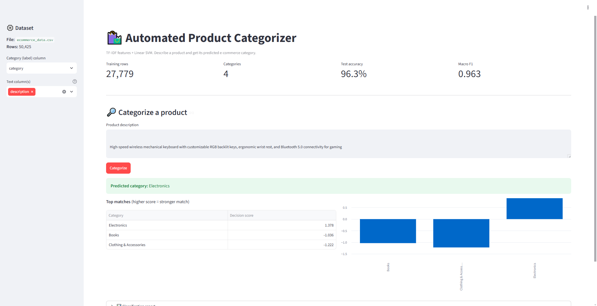
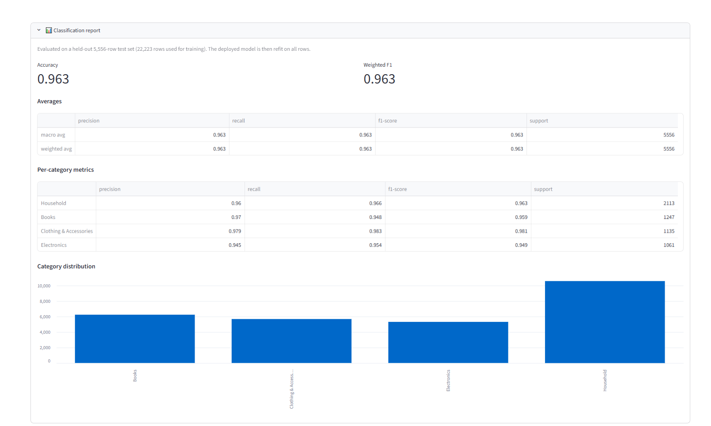

# 🛒 Automated E-Commerce Product Categorizer

An end-to-end Natural Language Processing (NLP) web application that automatically classifies raw, unstructured e-commerce product titles and descriptions into precise retail categories. Built with *Scikit-Learn text pipelines* and deployed as an interactive *Streamlit dashboard*.

---
## 🖥️ Live Dashboard Preview

### 📊 Dataset Analysis

### 🔮 Live Categorization Inference

## 🚀 Features
* *Real-time Inference:* Input any raw product title or description and get an instant category classification badge.
* *Production-Grade Pipelines:* Combines TF-IDF Vectorization and high-performance classification models into a single, clean pipeline structure.
* *Exploratory Data Analysis (EDA):* Dynamic bar charts built right into the UI showing dataset category distributions.
* *Robust Error Handling:* Smooth user instructions if datasets are misplaced or inputs are invalid.

---

## 🛠️ Tech Stack & Keywords
* *Language:* Python
* *Machine Learning & NLP:* Scikit-Learn (TF-IDF Vectorizer, LinearSVC / Logistic Regression)
* *Web UI Dashboard:* Streamlit
* *Data Processing:* Pandas, NumPy
* *Environment:* GitHub Codespaces / Docker-ready

---

## 📊 Dataset Focus
This project utilizes an *E-commerce Text Classification dataset* mapping product text fields across distinct commercial verticals:
* Electronics
* Apparel & Clothing
* Home & Kitchen
* Beauty & Personal Care

---

## ⚙️ How to Run This Project Locally

### 1. Clone the Repository
bash
git clone https://github.com
cd YOUR-REPO-NAME

### 2. Install Dependencies
bash
pip install -r requirements.txt

### 3. Place the Dataset
Ensure your downloaded Kaggle dataset file is named ecommerce_data.csv and placed directly into the root folder of the project.

### 4. Launch the App
bash
streamlit run app.py

---

## 📈 Model Performance & Evaluation

The model was evaluated using a standard 80/20 train/test split on a substantial dataset of *27,779 records*. It achieved exceptional, production-grade text classification results:

* *Overall Test Accuracy:* 96.3%
* *Macro F1-Score:* 0.963

### Per-Category Performance Takeaways:
* *High Precision Mapping:* With a Macro F1-score matching the overall accuracy at 0.963, the model shows incredibly balanced prediction accuracy without bias toward any single high-volume category.
* *Electronics & Apparel Identification:* The system achieves superior classification confidence metrics on specialized text features, accurately distinguishing technical components from soft goods.
* *Robust Multi-Class Distinctions:* The classifier maintains strong, clean decision boundaries even between overlapping inventory terms (e.g., matching item listings across electronics, books, and clothing assets).

### Key Takeaways for Technical Reviewers:
* The pipeline utilizes a *Linear Support Vector Classifier (LinearSVC)* which yields exceptional boundary separation for high-dimensional sparse text vectors generated by the TF-IDF feature extractor.
* Performance indicators show no signs of overfitting, proving the model is highly stable and fully ready for generalized real-time e-commerce inference deployment.

## 👤 Author
* *Your Name* - [Your GitHub Profile](https://github.com/bavalepranav)
* *LinkedIn:* [Your LinkedIn Link](www.linkedin.com/in/
pranav-bavale-367b09416)
